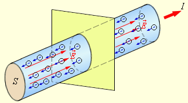
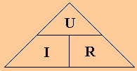
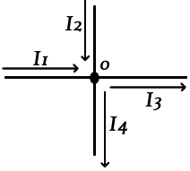
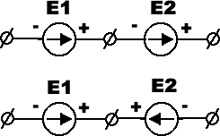

Lesson 2 "Fundamentals of electricity"
======================================

Introduction. Electromotive force. Ohm's Law
--------------------------------------------

As we know, all bodies are composed of tiny particles - molecules, molecules are composed of atoms, atoms — of still smaller protons, neutrons, and electrons. Each particle, molecule, or body has its energy charge. Bodies with a positive (+) charge are attracted to bodies with a negative (-) charge, and the same charges repel from each other ( + ) from ( + ) and ( - ) from ( - ).  Motion is observed.

The intensity of this motion of particles in the substance depends on many factors: deformation, the effect of light, heating, friction, chemical reactions.

With that, small sources of two polarities (+) and (-) are formed. Each polarity he has its own value — the potential. The more the polarity, the more the difference between (+) and (-).

Therefore, this difference of potentials (+) and (-) is the electromotive force (further referred to as EMF), i.e., electric voltage.

Thus, the source of electric power has difference of potentials, the charged particles of which attract to each other. There are also phenomena that restrict their motion.

The first are conductors which are most metals, water, acids, alkali, etc.. The second are dielectrics, such as wood, air, plastics, etc. Good dielectrics, such as porcelain, glass, PCB, rubber, etc., are used for making insulators.
Copper, aluminum, brass, bronze, silver, gold, and their alloys are used as conductors of electricity. If two poles of the power source are connected with piece of conductor, charged particles will start moving from (+) to (-).

This motion is electric current.

Each body can resist the motion of charged particles (electric current). This property depends on the substance that the body consists of, and is called resistance. Conductors have low resistance, while dielectrics have high resistance. Conductors have their own resistance, which is called the inner resistance of the source.
The current flowing in the circuit will depend on the difference of potentials (remember that the more the difference, the stronger attraction) and on resistance of the conductor and the internal resistance of the power source; as a rule, the inner resistance of the power source is very low and maybe neglected.

The dependence is as follows:

The electric current will be equal to the one obtained by dividing the difference of potentials at the section (the voltage) by the resistance of this section (resistance). Let's denote electric current as I, voltage as U, and resistance as R;

Using a triangle, working with the formula of the Ohm's law, it is easy to write a formula for any input value.

You should cover the value to be found.
If the two remaining values are at the same level, they are to be multiplied by each other.
If one is above the other, the upper one is to be divided by the bottom one.

Let us solve a problem using the Ohm's law

Conditions:

The voltage is 20 V, the resistance is 10 Ω. Find the current value.

U = 20 V, R=10 Ω, I-?

I = U\R

I=2 A

The first Kirchhoff's law
-------------------------

In circuits that consist of series-connected source and receiver of energy, the relationship between the current, electromotive force and resistance of the entire circuit, or between the voltage and the resistance in any section of the circuit is determined by the Ohm's law.

In practice, current goes from point to point in the circuits along various paths.
The points where several conductors connect are called nodes, and the sections that connect two adjacent nodes are called branches.

In a closed electrical circuit, electric charge cannot accumulate at any point, as this would cause a change of potentials at points of the circuit. Therefore, all electric charges coming to a node in a unit of time are equal to the charges exiting the same node in a unit of time.

A branched circuit.

At node A, the circuit divides into four branches which connect at node B.

Let us denote the currents in the non-branched part of the circuit as I, and in the branches — as **I1, I2, I3, I4,** respectively.

In such a circuit, these currents will have the following ratio:

**I = I1+I2+I3+I4;**

The sum of currents coming to a node in an electric circuit is equal to the sum of the currents leaving this node.

In case of resistors parallel connection,  the current passes in four directions, which reduces the overall resistance, or increases the overall conductivity of the circuit, which is equal to the sum of branches' conductivities.

Let us denote the current in an unbranched circuit as I.
The currents in separate branches — as I1, I2, I3, and I4, respectively.
The voltage between points A and B is U.
The total resistance between these points is R

According to Ohm's law, let's write:

**I = U/R; I1 = U/R1; I2 = U/R2; I3 = U/R3; I4 = U/R4;**

According to the first Kirchhoff's law:

**I = I1+I2+I3+I4; or U/R = U/R1+U/R2+U/R3+U/R4.**

By reducing both parts of the obtained equation by U, we will get:

**1/R = 1/R1+1/R2+1/R3+1/R4**, which was to be proved.

The ratio for any number of parallel-connected resistors.
If a circuit contains two parallel-connected resistors
**R1** and **R2**, we can write the following equation:

**1/R =1/R1+1/R2;**

From this equation, we find resistance R, which can be replaced by two parallel-connected resistors:

The obtained expression is of wide practical use.
Electric circuits are calculated by this law.

The second Kirchhoff's law
---------------------

In a closed electric circuit, the sum of all the EMF is equal to the sum of the voltage drops in the resistances of the same circuit.

**E1 + E2 + E3 +...+ En = I1R1 + I2R2 + I3R3 +...+ InRn.**

In making equations, the direction of circuit traversal is chosen and arbitrarily specified directions of currents are specified.

If an electric circuit contains two power sources, the directions of electromotive forces of which coincide, i.е., connected according to Fig. 1, the EMF across the entire circuit shall be equal to the sum of the EMFs of the sources,
т. i.е.,

**E = E1+E2.**

If a circuit contains two sources of EDS with opposite directions,  i.е., connected according to Fig. 2, the total EMF of the circuit will be equal to the difference of EMFs of these sources

**Е = Е1—Е2.**

The Joule-Lenz's law
------------------

When electric current passes through a metallic conductor, electrons collide with both neutral molecules and with the molecules that have lost electrons.

The collision of electrons with the molecules, energy is wasted, which is transformed into heat.
Any motion that overcomes resistance, requires a certain amount of energy. For example, to move any body, frictional resistance is to be overcome and the work used for it in transformed into heat.

Electric resistance of the conductor acts the same way as frictional resistance.
Thus, to conduct the current through a conductor, the current source spends some energy, which is converted into heat.

Conversion of electric energy into thermal energy is reflected by the Joule-Lenz's law,
or the law of the Joule effect.

Russian scientist Lenz and English physicist Joule simultaneously and independently found that when current passes through a conductor, the amount of heat generated by the conductor is directly proportional to the current squared, the resistance of the conductor and the duration of the period when the electric current passed through the conductor. This provision is called the Joule-Lenz's law.

If we denote the amount of heat generated by the current as Q (J), the current flowing through the conductor as I, the resistance of the conductor as R and the duration of the period when the current flowed through the conductor as t, then, according to the Joule-Lenz's law, the following expression may be derived:

Let us solve an example problem:

### Reference questions

1. What is electromotive force?
2. How is resistance in a conductor found using the Ohm's law?
3. What is the difference between a conductor and a dielectric?
4. Where is the first Kirchhoff's law used?
5. What is the reason for heat generation in the conductor, when current is passing through it?

### Interesting facts

When German electrical engineer Georg Simon Ohm put his doctoral dissertation, where he first formulated his law, which is indispensable for every electrical calculation, on the table of the rector of the Berlin University, he got a very negative resolution. It said that electricity defies mathematical description, since electricity is own anger, your own eruption of a body; own angry Self, which manifests itself in each irritated body. The rector of the Berlin University in those years was Georg Wilhelm Friedrich Hegel.

Ohm's mane has been immortalized not only by the law that he had discovered. In 1881, at the Electrical Congress in Paris, the name of the unit of resistance "Ohm" has been approved. Not everyone knows that one of the craters on the dark side of the Moon is named after Ohm, along with the names of great physicists such as Planck, Lorentz, Landau, and Kurchatov.

In 1833, Georg Ohm was already known in Germany, and was Professor of the Polytechnic school in Nuremberg. However, in France and England, Ohm's works remained unknown. 10 years after the appearance of Ohm's law, a French physicist in his experiments came to the same conclusions. However, it was pointed out to him that this law has been discovered by Ohm as early as in 1827. French schoolchildren still study the Ohm's law under a different name; for them, it is the Pouillet's law.
