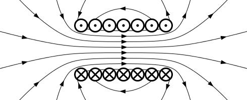
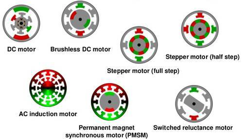
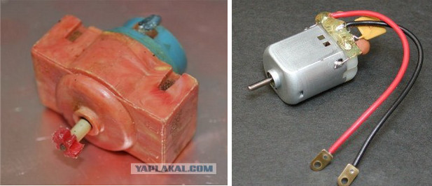
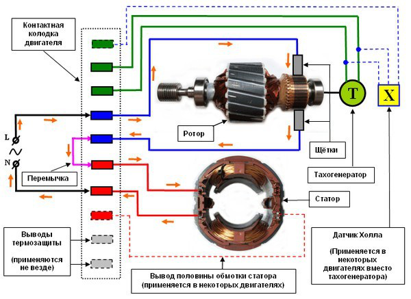
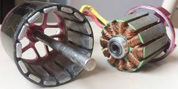
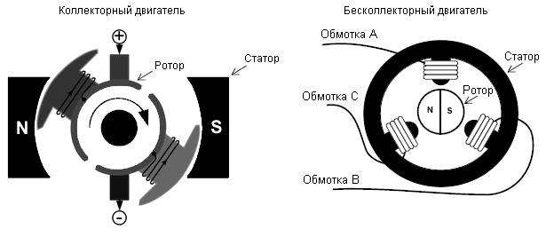

Lesson 6 "Fundamentals of electromagnetism. Types of motors"
===================================================

Basic laws of electromagnetism
---------------------------------

### Ampere's law

**Ampere's law** — the law of electric currents interaction. It was first discovered by Andre Marie Ampere in 1820 for direct current. From the Ampere's law it follows that parallel conductors with electric currents flowing in the same direction attract, and with electric currents flowing in the opposite direction, repel.

Ohm's Law
---------

**Ohm's law** is a physical law that determines the relationship between the electromotive force of a source (or electric voltage) with the current flowing in the conductor, and the resistance of the conductor. It was discovered by Georg Ohm in 1826, and named in his honor.

Coulomb's Law
------------

**Coulomb's law** is the law that describes the force between stationary point-like electric charges.
"The force of interaction of two point-like charges in the vacuum is directed along the straight line that connects these charges, proportionally to their magnitudes and inversely proportionally to the distance squared between them. It is the force of attraction if the charges are different, and the force of repulsion if the charges are the same."

Types of motors
---------------

Each motor has certain distinctive properties, which determine the scope of use, where it would be most appropriate. Synchronous, asynchronous, direct current, brush-type, brushless, valve-inductor, stepper ones...

### A DC motor (DCM)

Motors of this type used in most old toys. A battery and two wires to the contacts. Such a motor contains a commutator installed on the shaft, which switches the windings depending on the rotor position. Direct current applied to the motor runs alternatively in some and other parts of the winding thus creating torque.

DC motors may be both small (a vibro in your telephone), and rather large — usually up to a megawatt. For example, the photo below shows a traction motor of an electric locomotive with the power of 810 kW and voltage of 1,500 V.

### A universal commutator motor

Oddly enough, this is the most common motor in the household use, the name of which is the least known. Why did this happen? Its design and features are the same as those of a DC motor, therefore it is mentioned in textbooks usually in the very end of the chapter.

This type of engine is more widely available in household appliances where it is required to adjust the rotation speed: drills, washing machines (not with "direct drive"), vacuum cleaners, etc. Why is it so popular? Due to the simplicity of regulation. Like in an AC motor, it can be adjusted by voltage, through a symistor (bidirectional thyristor) for AC power. The control circuit may be so simple, which is placed, for example, directly in the "trigger" of the power tool, and requires neither microcontroller, nor a PWM, nor a rotor positioning sensor.

### Asynchronous motor

Asynchronous motors are used in the household: in the devices where there is no need to adjust the rotation speed. Most often it is the so-called "capacitor" engines, or, equivalently, "single-phase" asynchronous engines. But actually, from the point of view of the motor, it is correct to say "two-phase", simply one phase of the motor is connected to the AC network directly, and the other — through a capacitor. The capacitor causes a voltage phase shift in the other winding, which allows creating a rotating elliptical magnetic field. Usually such motors are used in exhaust fans, refrigerators, small pumps, etc.

### Synchronous motor

There are several subtypes of synchronous motors — with magnets (PMSM) and without magnets (with an excitation winding and slip rings), with sinusoidal or trapezoidal EMF (brushless DC motors, BLDC). Some step motors may also be included here. Before the era of power semiconductor electronics, the destiny of synchronous machines was being used as alternators (almost all alternators in all power plants are synchronous machines), as well as powerful drives for any serious load in the industry.

### Comparison of brushed and brushless motors

In radio controlled models with electric motors, brush and brushless motors are used.
A brief comparison of the types of engines: brush-type motors develop lower speed. Brushless motors can develop more speed, and are also more durable.

### Brush-type motors

These have brush-collector units, which ensure movement of radio-controlled models. The collector is essentially a set of contacts on the rotor and brushes — sliding contacts, which are located outside the rotor.
How it works: Works from DC. I.e., by applying voltage from a DC source (a battery) one makes it move. To change the direction, simply reverse current polarity. This is a fairly simple mechanism, and therefore, motors of the brush type are cheaper. This type of motors belongs to the earlier type with the **efficiency** of **60 %**, as calculated by specialists.

**Advantages of brush-type motors in radio-controlled models** include:

* Light weight of the motor

* Small size of the motor

* Lover cost of the motor

* Repairability

**Disadvantages of brush-type motors:**

* Lower efficiency of the motor

* Lower maximum developed speed

* Mechanical work of brushes and collector may result in sparkling if overheated

* Rapid wear

Brushless motors, in which the moving part is the stator, are more efficient than brush-type motors. This is achieved due to the absence of brushes. However, since motor design is much more complicated, they are more expensive.

**Advantages:**

* High motor efficiency — up to 92 %

* Higher maximum developed speed

* More wear resistant due to the closed type of the motor

* Better protected from moisture, dust and dirt

**Disadvantages:**

* High cost

* More complicated repair

### Reference questions

1. What behavior of conductors with electric currents follows from the Ampere's law?
2. According to Coulomb's law, how do two point charges interact in vacuum?
3. What is the main difference between brush-type and brushless motors?
4. What are the characteristics of brushless motors that make them suitable to be used in quadcopters?
