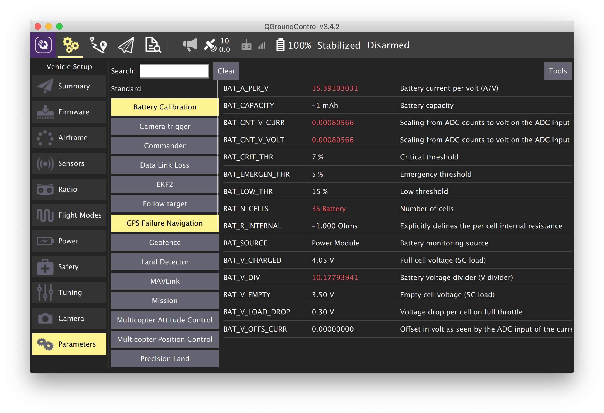

# PX4 Parameters

Main article: https://dev.px4.io/en/advanced/parameter_reference.html

> **Note** This is a description some of the most important PX4 parameters as of version 1.8.0. The full list is available at the link above.

To change PX4 parameters, you can use the QGroundControl application [by connecting to Clover via Wi-Fi](gcs_bridge.md):

## Main parameters

The most important parameters are listed in this paragraph.

`SYS_MC_EST_GROUP` – select the estimator module.

This is a group of modules that calculates the current state of the copter using readings from the sensors. The copter state includes:

* Angle rate of the copter – pitch_rate, roll_rate, yaw_rate;
* Copter orientation (in the local coordinate system) – pitch, roll, yaw (one of presentations);
* Copter position (in the local coordinate system) – x, y, z;
* Copter speed (in the local coordinate system) – vx, vy, vz;
* Global coordinates of the copter – lattitude, longitude, altitude;
* Altitude above the surface;
* Other parameters (the drift of gyroscopes, wind speed, etc.).

`SYS_AUTOCONFIG` — resets all parameters (sets to 1).

## EKF2

`EKF2_AID_MASK` — selects sensors that are used by EKF2 to calculate the copter state.

`EKF2_HGT_MODE` is the main source of height data (z in the local coordinate system):

* 0 – pressure reading on the barometer.
* 1 – GPS.
* 2 – distance meter (for example, vl53l1x).
* 3 – data from VPE.

Variant 2 is the most accurate; however, it is correct to use it only if the surface the copter flies over is flat. Otherwise, the Z axis origin will move up and down with the altitude of the surface.

## Multicopter Control Position (flying by position)

These parameters adjust the flight of the copter by position (POSCTL, OFFBOARD, AUTO modes).

`MPC_THR_HOVER` — hovering throttle. This option is to set to the approximate percentage of throttle needed to make the copter maintain its altitude. If copter has a tendency to gain or lose altitude during the hovering mode, reduce or increase this value.

`MPC_XY_P` – position factor *P* of the ESC. This parameter affects how sharply the copter will react to the position commands. A too high value may cause {перестрелы}.

`MPC_XY_VEL_P` – speed factor *P* of the ESC. This parameter also affects the accuracy and sharpness of copter execution of the given position. A too high value may cause {перестрелы}.

`MPC_XY_VEL_MAX` — the maximum horizontal speed in POSCTL, OFFBOARD, AUTO modes.

`MPC_Z_P`, `MPC_Z_VEL_P` – vertical position and speed factors *P* of the ESCs they determine the copter's ability to maintain the desired altitude.

`MPC_LAND_SPEED` is the vertical velocity of landing in the LAND mode.

## LPE + Q attitude estimator

These parameters configure the behavior of the `lpe` and `q` modules, which compute the state (orientation, position) of the copter. These parameters apply **only** if the `SYS_MC_EST_GROUP` parameter is set to `1` (local_position_estimator, attitude_estimator_q)

TODO

## Commander

Prearm checks, switching the modes and states of the copter.

## Sensors

Enabling, disabling and configuring various sensors.

TODO
